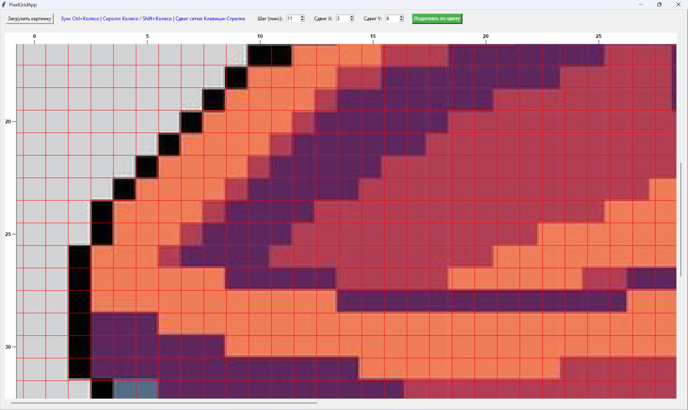

# PixelGridApp

Программа с графическим интерфейсом (GUI) на Python, разработанная для точного наложения координатной сетки на изображение, масштабирования с пиксельной точностью и последующей «подгонки» (пикселизации) картинки под настроенную сетку. Подходит для создания схем вышивки, мозаики, пиксель-арта или анализа текстур.

## 🚀 Основные возможности

*   **Наложение динамической сетки**: отображение настраиваемой координатной сетки поверх любого изображения.
*   **Умные оси нумерации**: вывод номеров ячеек (каждой 5-й для экономии места) по краям экрана. Линейки остаются неподвижными у краев окна во время прокрутки.
*   **Пиксельная точность при зуме**: масштабирование изображения без размытия (используется фильтр `Nearest Neighbor`), при этом шаг сетки жестко привязан к пикселям картинки.
*   **Подгонка по цвету**: автоматический анализ каждой ячейки сетки, определение доминирующего (самого частого) цвета и заполнение им всей ячейки.
*   **Безопасный экспорт**: сохранение обработанного результата в отдельный файл с суффиксом `_ranged` в ту же папку, где лежит исходная картинка.

---

## 🕹 Управление и горячие клавиши

### Панель управления (GUI):
*   **Загрузить картинку**: открывает диалоговое окно для выбора файла (`.png`, `.jpg`, `.jpeg`, `.bmp`, `.gif`).
*   **Шаг (пикс)**: устанавливает размер ячейки сетки в пикселях исходного изображения.
*   **Сдвиг X / Сдвиг Y**: смещение сетки по горизонтали и вертикали для точного позиционирования.
*   **Подогнать по цвету**: запускает алгоритм пикселизации и сохраняет файл.

### Горячие клавиши и мышь:
*   `Ctrl` + `Колесико мыши` — **Масштабирование (Зум)** изображения и сетки (от 10% до 3000%).
*   `Колесико мыши` (без клавиш) — **Прокрутка вверх / вниз** (если картинка не влезает в окно).
*   `Shift` + `Колесико мыши` — **Прокрутка влево / вправо**.
*   Клавиши `⬅️` / `➡️` (Стрелки) — **Изменение сдвига сетки по X** на ±1 пиксель.
*   Клавиши `⬆️` / `⬇️` (Стрелки) — **Изменение сдвига сетки по Y** на ±1 пиксель.

---

## 🛠 Системные требования и установка

Программа написана на **Python 3** и использует встроенную графическую библиотеку `tkinter`, а также популярную библиотеку обработки изображений `Pillow`.

### 1. Установка зависимостей
Убедитесь, что у вас установлен Python (версии 3.7 или новее). Затем установите библиотеку `Pillow` через терминал или командную строку:

```bash
pip install Pillow
```

### 2. Запуск программы
Сохраните код скрипта в файл (например, `app.py`) и запустите его командой:

```bash
python app.py
```

---

## 📦 Сборка в независимый .exe файл (необязательно)

Если вы хотите запускать программу на компьютерах, где не установлен Python, вы можете собрать её в один самостоятельный исполняемый файл с помощью утилиты `pyinstaller`.

1. Установите сборщик:
   ```bash
   pip install pyinstaller
   ```
2. Выполните команду сборки (флаг `--onefile` соберет всё в один файл, а `--noconsole` скроет фоновое черное окно терминала):
   ```bash
   pyinstaller --onefile --noconsole app.py
   ```
3. Готовый файл появится в папке `dist/` рядом с вашим скриптом.

---

## 🎥 Внешний вид

